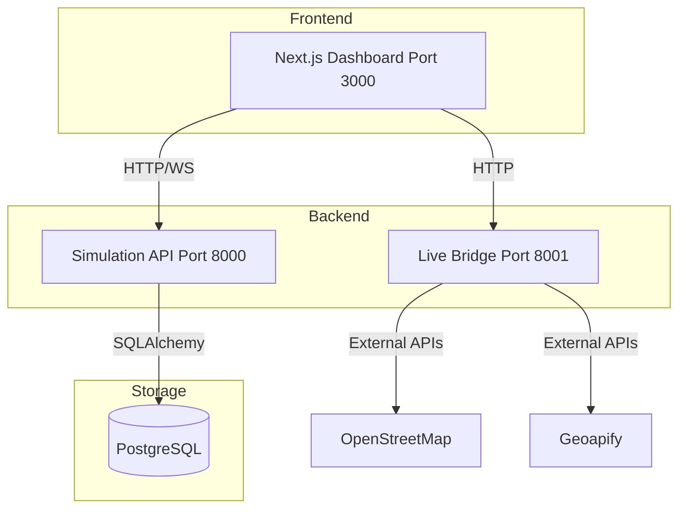

# FLUXION — SaaS Waste Collection Optimization


FLUXION is a next-generation SaaS platform designed to optimize municipal waste collection using a multi-level algorithmic engine (Dijkstra, Bipartite Matching, VRP, and NSGA-II).

---

## 🛠 Architecture



---

## 🚀 Quick Start

### 📋 Prerequisites
- **Python 3.11+**
- **Node.js 20+**
- **PostgreSQL 15+**

### 📥 Backend Setup
1. **Install dependencies**:
   ```bash
   pip install -r requirements.txt
   ```
2. **Environment Variables**:
   ```bash
   cp .env.example .env
   # Edit .env with your PostgreSQL credentials and API keys
   ```
3. **Database Migrations & Seeding**:
   ```bash
   alembic upgrade head
   python scripts/seed_data.py
   ```

### 🏃 Running the Services
- **Simulation API**: `python -m niveau5.src.api` (Port 8000)
- **Live Bridge**: `python -m live_bridge.api_bridge` (Port 8001)
- **Frontend Dashboard**:
  ```bash
  cd dashboard
  npm install
  npm run dev # Port 3000
  ```

---

## 📂 Project Structure

```
FLUXION/
├── commun/           # Shared Python utilities (DB, constants, geo)
├── niveau1/          # Level 1: Road Network (Dijkstra)
├── niveau2/          # Level 2: Fleet Assignment (Bipartite)
├── niveau3/          # Level 3: Temporal Planning (Tripartite)
├── niveau4/          # Level 4: VRP Optimization (2-opt, Tabu)
├── niveau5/          # Level 5: Dynamic Brain (NSGA-II)
├── live_bridge/      # Real-world data ingestion
├── dashboard/        # Next.js 16 Frontend
└── scripts/          # Automation & Seeding scripts
```

---

## 🧬 Algorithm Levels

| Level | Name | Technique | Goal |
|---|---|---|---|
| **L1** | Road Network | Dijkstra | Find shortest paths between bins. |
| **L2** | Fleet Assignment | Bipartite Matching | Balance bins across available trucks. |
| **L3** | Temporal Planning | Tripartite Graph | Schedule routes within city bans & driver breaks. |
| **L4** | VRP Optimization | 2-opt + Tabu Search | Minimize total travel distance per truck. |
| **L5** | Dynamic Brain | NSGA-II | Adaptive replanning based on live events. |

---

## 🔒 RBAC Roles

| Role | Access Level |
|---|---|
| `super_admin` | Full system access. |
| `fleet_manager` | Analytics, route configuration, and manual triggers. |
| `driver` | Mobile-first companion with specific route checklists. |

---

## 📦 Production Deployment

### 🐳 Docker (Recommended)
The project includes a production-ready Docker Compose setup:
```bash
docker-compose up --build
```
This spawns 5 services: **PostgreSQL**, **Simulation API**, **Live Bridge**, **Dashboard**, and an **Nginx** gateway.

---

## 📚 Deep Dive Documentation

For a comprehensive technical understanding of the FLUXION engine and its UI, refer to the newly published manuals:

- 🏗️ **[Architectural Overview](docs/ARCHITECTURE.md)**: Design philosophy, 5-Level algorithmic evolution, and data flow.
- ⚙️ **[Backend Technical Manual](docs/BACKEND.md)**: Python simulation, VRP heuristics (Tabu Search, 2-Opt), and WebSocket async architecture.
- 🎨 **[Frontend Technical Manual](docs/FRONTEND.md)**: Next.js App Router, real-time hooks, Map filtering, and UI theming.
- 📊 **[Data Layer Specification](docs/DATA_LAYER.md)**: Geo-scaling strategy, coordinate normalization, and dataset ingestion.
- 🚀 **[Deployment Guide](docs/DEPLOYMENT.md)**: Step-by-step instructions for running the distributed stack in production via Docker Compose.

---

## 📜 License
This project is licensed under the **MIT License**.
